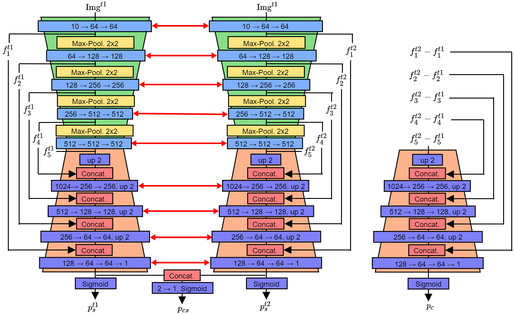

# Urban Change Detection Using a Dual-Task Siamese Network and Semi-Supervised Learning

In this study, a Semi-Supervised Learning (SSL) method for improving urban change detection from bi-temporal image pairs was presented. The proposed method adapted a Dual-Task Siamese Difference network that not only predicts changes with the difference decoder, but also segments buildings for both images with a semantics decoder. First, the architecture was modified to produce a second change prediction derived from the semantics predictions. Second, SSL was adopted to improve supervised change detection. For unlabeled data, we introduced a loss that encourages the network to predict consistent changes across the two change outputs. The proposed method was tested on urban change detection using the SpaceNet7 dataset. SSL achieved improved results compared to three fully supervised benchmarks.

# The Proposed Method

The architecture of the proposed network is shown below.



# Replicating our results
## 1 Download the data

The SpaceNet7 dataset is hosted on AWS as a Public Dataset. It is free to download, but an AWS account is required.

#### Train data
aws s3 cp s3://spacenet-dataset/spacenet/SN7_buildings/tarballs/SN7_buildings_train.tar.gz . 

aws s3 cp s3://spacenet-dataset/spacenet/SN7_buildings/tarballs/SN7_buildings_train_csvs.tar.gz . 
#### Test data

aws s3 cp s3://spacenet-dataset/spacenet/SN7_buildings/tarballs/SN7_buildings_test_public.tar.gz .

Alternatively, the dataset can be downloaded from Radiant MLHub:
https://mlhub.earth/data/spacenet7

## 2 Preprocess

To preprocess the dataset run the following for the train and test set:

````
python preprocessing.py -s 'path to SpaceNet7 directory' -d 'dataset (train/test)'
````
## 3 Train the network

Run the ``train_semisupervised_dualtask.py`` file to train the above network using semi-supervised learning:

````
python train_semisupervised_dualtask.py -c dtsiamese_ssl_test -o 'path to output directory' -d path to SpaceNet7 directory'
````

Likewise, the baselines can be replicated by running the ``train_supervised.py`` file with the configs ``unet`` and ``siamese``, and the ``train_supervised_dualtask.py`` with the ``dtsiamese`` config.


## 4 Evaluation

Use the files ``assessment_semantics.py`` and ``assessment_change.py`` to assess network performance for build-up area mapping and built-up change detection, respectively. Both files feature a quantitative and qualitative assessment.

# Credits

If you find this work useful, please consider citing:


  ```bibtex
@inproceedings{hafner2022urban,
    title={Urban change detection using a dual-task Siamese network and semi-supervised learning},
    author={Hafner, Sebastian and Ban, Yifang and Nascetti, Andrea},
    booktitle={IGARSS 2022-2022 IEEE International Geoscience and Remote Sensing Symposium},
    pages={1071--1074},
    year={2022},
    organization={IEEE}
}
  ```
  